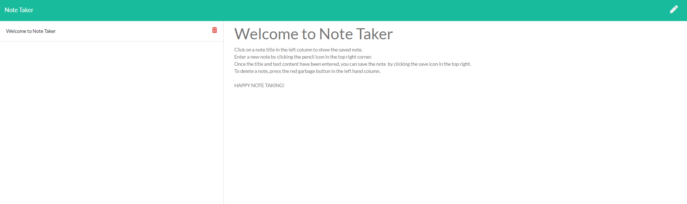

# Note Taker

## Description
Note Taker is an application that allows you to view, write, and save notes.

## Table of Contents

* [Usage](#Usage)
* [License](#License)
* [Questions](#Questions)
* [Credits](#Credits)

## Usage
website url: https://note-taker-123456789.herokuapp.com   

## License
MIT License

## Questions
You may contact the project author via:
* Email: seanbrent5@live.ca
* GitHub: [Brentsa](https://github.com/Brentsa)

## Credits
Created by Sean Brent